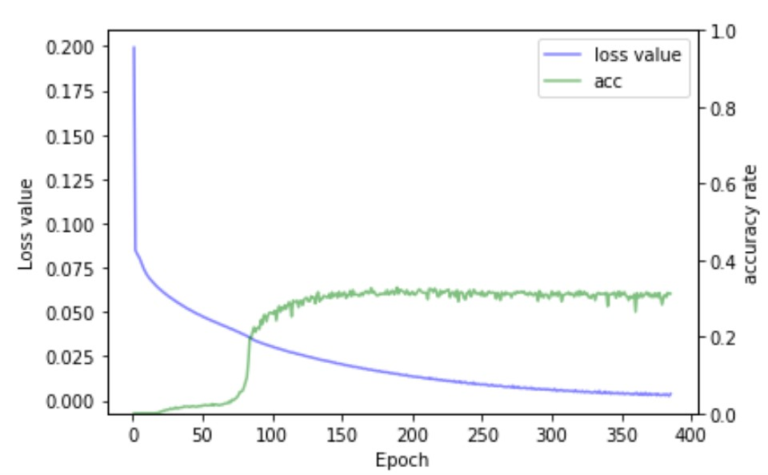

# Scene-Text-Recognition
This project is the third project of DATA130011.01 Neural Network and Deep Learning(2021)

## Introduction
* The project requirements can be seen in the file **final_project_3.pdf**.
* The details of this project can be seen in the file **report.pdf**.
* The codes of text detection implemented by EAST can be seen in folder **EAST**.
* The codes of text recognition implemented by crnn can be seen in folder **crnn**.

## Results
### The results of text detection implemented by EAST.

 

### The results of text recognition implemented by crnn.

